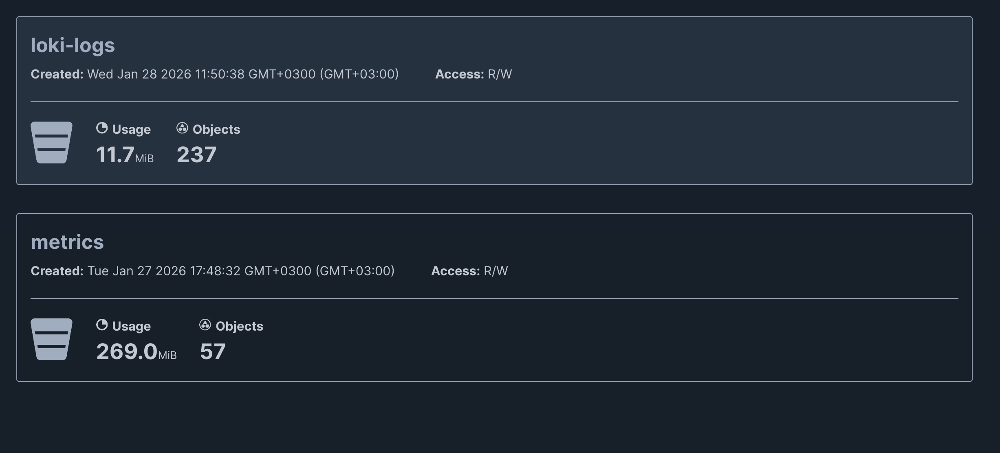
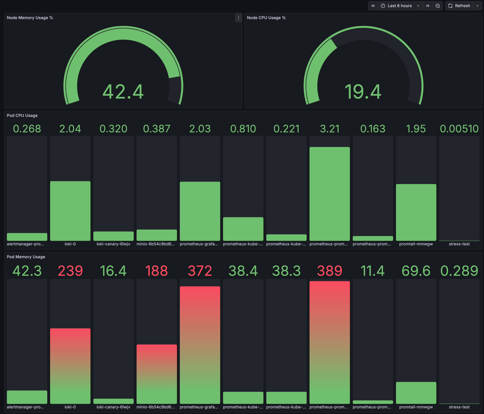
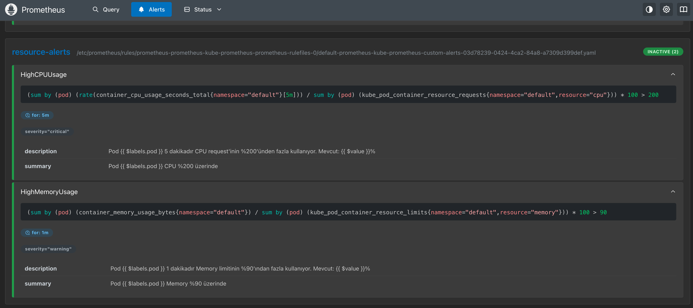
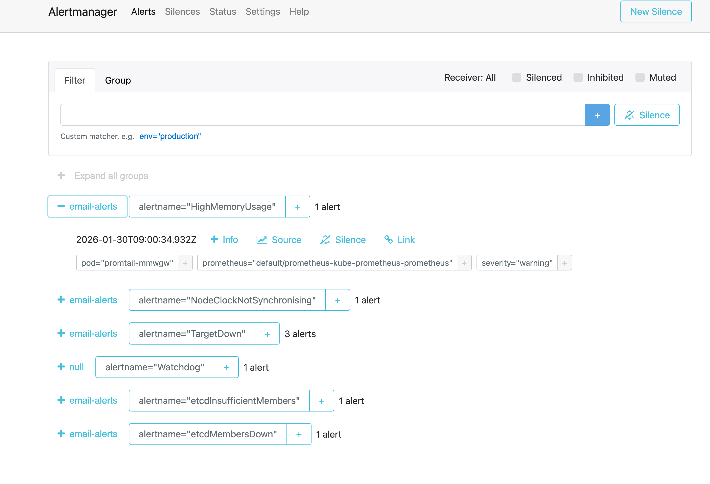
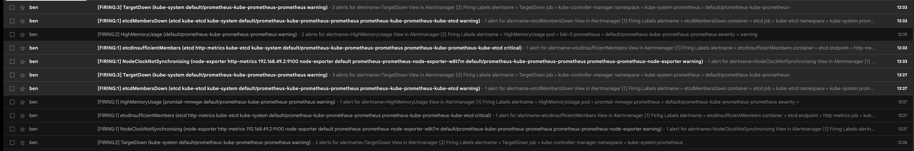
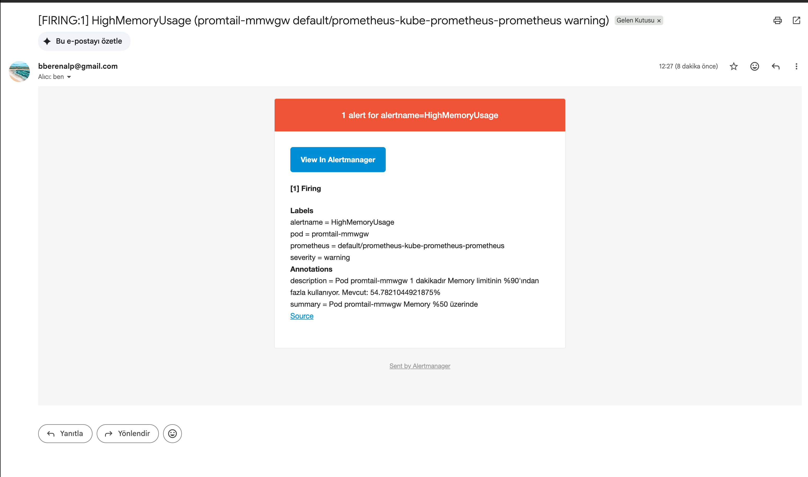
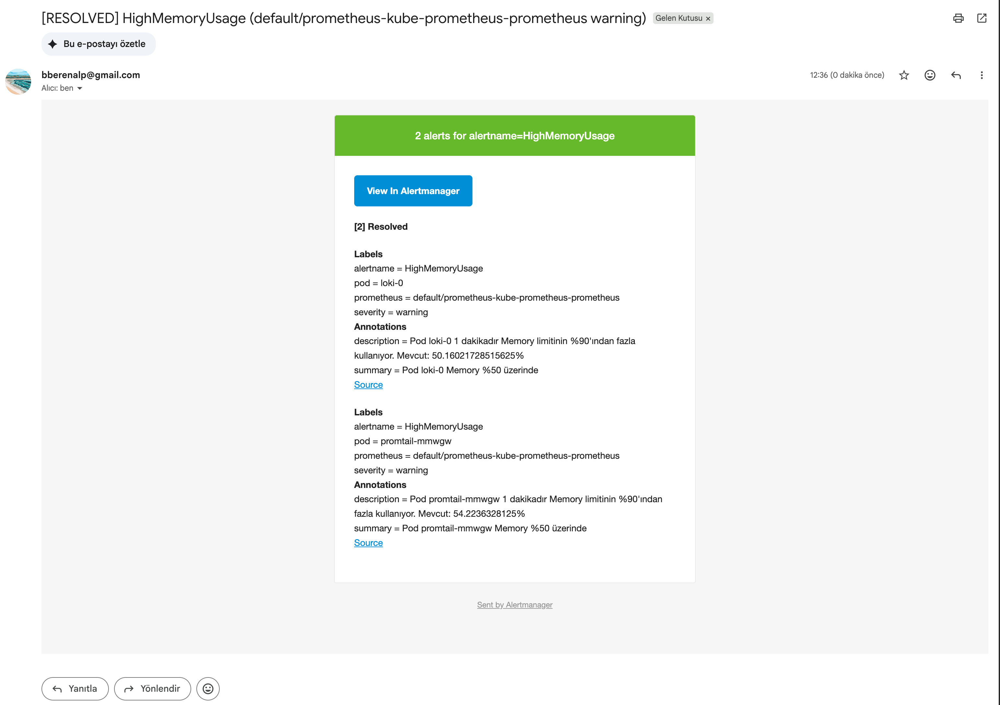

# C4N Observability Case Study







## 1: Kubernetes Metrik Toplama  

- Görev: Kubernetes üzerinde çalışan pod ve nodeların metrikleri merkezi bir yere toplayınız.
- Ödev Detayı: Metrikler 90 gün, Object Storage üzerinde saklanacak
- Soru: Object storage nedir? On-prem ve cloud için örnek verir misiniz?

_Cevap_
```
Minio                           -> Object storage
Prometheus                      -> Metrik toplar
Grafana                         -> Visualizes metrics 
Thanos                          -> Prometheus setup with long term storage capabilities
Thanos Sidecar                  -> Prometheus metriklerini MinIO'ya gönderme
Node Exporter                   -> Node (CPU, RAM, Disk)Metrikleri


# Object Storage 
  Verileri dosya ve klasör yerine object olarak saklayan depolama sistemi.
  Her objectin unique ID ve metadatası vardır
  - On Prem = AWS S3, GCP Storage, Azure Blob Storage
  - Cloud   = MinIO, Thanos, Ceph, OpenIO
  
## Neden Tercih edilir?
   - Ucuz ve scaleable
   - Uzun süreli saklama
   - HTTP API ile erişim

```

_Notlarım_
```
minio-values.yaml                                     -> minIO kurulumu 
helm install minio minio/minio -f minio-values.yaml   -> minio console'dan 'metrics' isimli bucket oluşturdum

prometheus-values.yaml                                -> Prometheus ve Thanos kurulumu
helm install prometheus prometheus-community/kube-prometheus-stack -f prometheus-values.yaml

Erişim
ssh -L 9001:192.168.49.2:30901 vagrant@192.168.56.30  # MinIO Console
ssh -L 3000:192.168.49.2:30030 vagrant@192.168.56.30  # Grafana


┌─────────────────┐     ┌─────────────────┐     ┌─────────────────┐
│   Node/Pod      │────►│   Prometheus    │────►│     MinIO       │
│   Metrikleri    │     │   + Thanos      │     │ (Object Storage)│
└─────────────────┘     └─────────────────┘     └─────────────────┘
        │                       │                       │ 90 Gün saklama
        │                       ▼                       │
        │               ┌─────────────────┐             │
        └──────────────►│    Grafana      │◄────────────┘
                        │(Görselleştirme) │
                        └─────────────────┘

```

## 2: Kubernetes Loglarının Toplanması  

- Görev: Kubernetes üzerinde çalışan pod ve nodeların loglarını merkezi bir yere  toplayınız.  
- Ödev Detayı: Loglar 90 gün, Object Storage üzerinde saklanacak
- Soru: rsyslogd nedir?

_Cevap_
```
rsyslogd: Linux/Unix sistemlerde log toplama ve yönetme servisidir.
  Sistem loglarını toplar (/var/log/messages, /var/log/syslog), filtreler ve yönlendirir.
  Uzak sunuculara TCP/UDP ile log gönderebilir.

Kubernetes ortamında:
  ryslogd -> geleneksel VM/sunucu log toplama
  Loki/Promtail -> Modern kubernetes log toplama
```

_Notlarım_
```
loki-logs                                            -> minIO'da yeni bucket oluşturdum
loki-values.yaml                                     -> loglar 90 saklanacak şekilde gün Loki kurulum

helm install loki grafana/loki -f loki-values.yaml

promtail-values.yaml                                 -> Promtail Kurulumu (Log Collector)
helm install promtail grafana/promtail -f promtail-values.yaml

http://loki:3100                                     ->  Grafana'da Loki Data Source ekledim 
Explore → Loki → namespace=default → Run query       -> Logları görmek için

┌─────────────────┐     ┌─────────────────┐     ┌─────────────────┐
│   Node/Pod      │────►│      Loki       │────►│     MinIO       │
│     Logları     │     │  (Log Storage)  │     │ (Object Storage)│
└─────────────────┘     └─────────────────┘     └─────────────────┘
        │                       │                       
        │                       ▼                       
        │               ┌─────────────────┐             
        └──────────────►│    Grafana      │
          Promtail      │ (Görselleştirme)│
                        └─────────────────┘
```

## 3: Grafik oluşturma  

- Görev: Topladığınız metrikleri seçeceğiniz bir tool ile görselleştirin
- Ödev Detayı: Topladığınız pod ve node metriklerini seçtiğiniz bir tool üzerinde grafik haline getirin. Tool helm ile kurulucak.
- Soru: Utilization nedir?

_Cevap_
```
Kullanım oranı. Bir kaynağın ya da sistemin sahip olduğu kapasitenin ne kadarının aktif 
  olarak kullanıldığını ifade eder
┌───────────────────────────────┐             
│  (Kullanılan / Toplam) × 100  │ Formülü ile hesaplanır
└───────────────────────────────┘
```

_Notlarım_
```
Grafana zaten Prometheus stack ile kurmuştum 

Custom Dashboard Oluşturma:
Dashboards -> New -> New Dashboard -> Add visualization

Node CPU Usage Query:
100 - (avg(irate(node_cpu_seconds_total{mode="idle"}[30m])) * 100)

Node Memory Usage Query:
(1 - (node_memory_MemAvailable_bytes / node_memory_MemTotal_bytes)) * 100

Pod CPU Usage Query:
sum(rate(container_cpu_usage_seconds_total{namespace="default"}[5m])) by (pod)

Pod Memory Usage Query:
sum(container_memory_usage_bytes{namespace="default"}) by (pod) / 1024 / 1024
```


## 4: Kelime ile arama (search)  

- Görev: Logların içerisinde arama yapın
- Ödev Detayı: Topladığınız pod ve nodeların loglarının içerisinde "error" ve "info" kelimelerini aratın ve kaç adet bulduğunuzu görselleştirin
- Soru: Search engine nedir?

_Cevap_
```
Büyük veri setleri içinde arama yapan sistem search engine.

Farklı çalışma prensibleri vardır:
  - Indexing         -> Verileri önceden indeksler
  - Query Processing -> Arama sorgusunu işler
  - Ranking          -> Sonuçları sıralar
  - Results          -> Eşleşen sonuçları döner

Farklı Search Engine Türleri:
  - Web Search Engine: Google, Yandex gibi web sayfaları arama motoru
  - Log Search Engine: Elasticsearch, Loki
  - Database Search: PostgreSQL full-text search

Log Search Örnekleri
  - Elasticsearch (ELK Stack) - Full-text search, ağır
  - Loki - Label-based search, daha hafif
  - Splunk - Enterprise log search

# Log vs Elasticsearch
Loki, label indexing düşük kaynak tüketimi ve grafana native bir log search engine iken 
    Elasticsearch full-text indexing, yüksek kaynak tüketimi ve kibana stack
```

_Notlarım_
```
Grafana → Explore → Loki

{namespace="default"} |= "error"        -> Error loglarını ara

{namespace="default"} |= "info"         -> Info loglarını ara

{namespace="default"} |~ "(?i)error"    -> Case-insensitive arama

count_over_time({namespace="default"} |= "error" [1h]) -> Dashboard Error count (last 1 hour)
count_over_time({namespace="default"} |= "info" [1h])  -> Dashboard Info count (last 1 hour)

Error vs Info karşılaştırma
Query A: sum(count_over_time({namespace="default"} |= "error" [5m]))
Query B: sum(count_over_time({namespace="default"} |= "info" [5m]))

```

## 5: Alarm üretme  

- Görev: CPU ve Memory kullanımı için alarm üzeretin
- Ödev Detayı:  CPU utilization 5 dakika boyunca %200 kullanıldığında ve Memory kullanımı  1 dakika boyunca %90 olduğunda alarm üretin
- Soru: İncident nedir? Nasıl manage edilir.


_Cevap_
```
Incident servisi etkileyen plansız kesinti veya performans düşüşü. Örneğin web sitesinin çökmesi,
  database bağlantı hatası ya da CPU %100 kullanımı gibi.

# Incident Manage Süreci

1 - Detection (Tespit)
  Monitoring/Alerting ile otomatik tespit ya da kullanıcı bildirimi

2 - Triage (Önceliklendirme)
  Severity belirleme (P1-Critical, P2-High, P3-Medium, P4-Low)

3 - Response (Müdahale)

4 - Resolution (Çözüm)
  Root cause analizi
  Fix
  Service restore
  
5 - Post-mortem (retrospektif)
  Ne oldu, Neden oldu, nasıl önlenir -> Dökümantasyon

Kullanılan Toollar
- PagerDuty, Opsgenie, VictorOps (On-call management)
- Jira, ServiceNow (Ticket management)
- Slack, Teams (İletişim)
- Grafana, Prometheus (Monitoring)

```

_Notlarım_
```

Prometheus-values.yaml      -> Alert kurallarını içinde tanımladım
additionalPrometheusRulesMap

# CPU Alert - %200 üzerinde 5 dakika
- alert: HighCPUUsage
  expr: (sum(rate(container_cpu_usage_seconds_total{namespace="default"}[5m])) by (pod) / sum(kube_pod_container_resource_requests{namespace="default", resource="cpu"}) by (pod)) * 100 > 200
  for: 5m
  labels:
    severity: critical

# Memory Alert - %90 üzerinde 1 dakika
- alert: HighMemoryUsage
  expr: (sum(container_memory_usage_bytes{namespace="default"}) by (pod) / sum(kube_pod_container_resource_limits{namespace="default",   resource="memory"}) by (pod)) * 100 > 90
  for: 1m
  labels:
    severity: warning

helm upgrade prometheus prometheus-community/kube-prometheus-stack -f prometheus-values.yaml -> prometheus güncelle

kubectl get prometheusrules                                               -> alert kurallarını kontrol
kubectl describe prometheusrule prometheus-kube-prometheus-custom-alerts  -> alert kurallarını kontrol

# Alerti Görüntüleme
- Prometheus UI: http://localhost:9090 → Alerts
- Alertmanager UI: http://localhost:9093
- Grafana: Alerting → Alert rules

```

## **Extra Zorluk: Ürettiğiniz alarmları mail olarak kendinize atın.**

_Notlarım_
```
# Email config - alertmanager.config altında
alertmanager:
  config:
    global:
      smtp_smarthost: 'smtp.gmail.com:587'
      smtp_from: 'your-email@gmail.com'
      smtp_auth_username: 'your-email@gmail.com'
      smtp_auth_password: 'your-app-password'
      smtp_require_tls: true
    route:
      receiver: 'email-alerts'
    receivers:
      - name: 'email-alerts'
        email_configs:
          - to: 'your-email@gmail.com'
            send_resolved: true
      - name: 'null'
```





